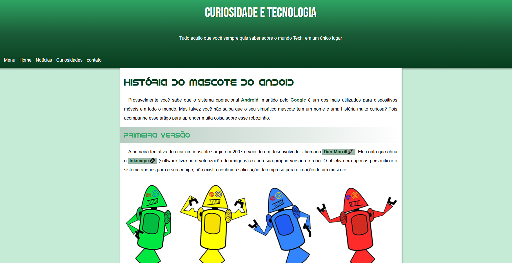
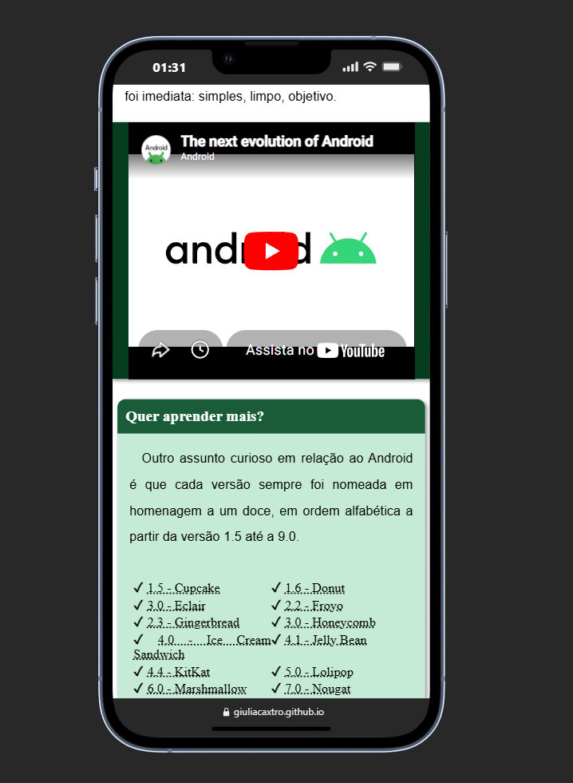

# 📱 Projeto Android

  

🔗 **Acessar projeto:**
https://giuliacaxtro.github.io/Meus-projetos/projeto-android/

Este projeto foi criado do zero com **HTML e CSS**.
O objetivo foi praticar a **estrutura de um site completo**, trabalhando com:

* Estrutura HTML
* Estilização com CSS
* Organização de conteúdo
* Layout de página

---